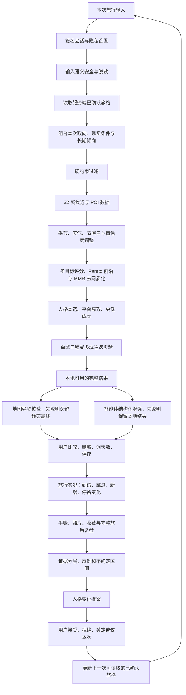

# 旅格 Travel Persona：完整工作逻辑链与 AI 接班手册

> 交接日期：2026-07-13  
> 工作区：`B:\travel`  
> 当前产品入口：`http://localhost:3000/app/`  
> 文档目的：让后续 AI 在不丢失产品原则、算法边界、隐私约束和工程状态的前提下继续完善。先读本文件，再改代码。

---

## 0. 一页结论

旅格不是一个“做完问卷就给城市榜单”的旅游推荐器。它的核心闭环是：

1. 在本次现实条件内，给用户可理解、可比较、可主动淘汰的旅行选择。
2. 旅行开始后只记录真实发生的变化，不把计划冒充经历。
3. 用户通过手账、照片、收藏、路线修改、取消地点和完整复盘逐步留下证据。
4. 系统只形成保守的“人格变化提案”，最终由用户接受、拒绝、锁定或说明“只代表这一次”。
5. 被确认的长期倾向只作为下一次推荐的一部分，永远不能压过预算、时间、体力、安全和当次意愿。

当前版本已经把这条链路从推荐、路线、地图降级、手账、证据、人格提案、真实足迹、数据权利、监控、备份和生产预检串了起来。现在最大的短板不是继续增加城市，而是把现有 **32 城**的数据做深、把真实地图与正式身份/语义安全 Provider 接好，并用真实用户样本校准人格推断。

**硬性范围决定：首发城市固定为 32 城。不要扩到 80、100 或全国。新增第 33 城会触发数据门禁失败。**

---

## 1. 用户真正想做的产品

### 1.1 核心体验

用户希望每趟旅行结束时产生的感受不是“我完成了一项成长任务”，而是：

- “每趟都很值得。”
- “认识新朋友或者有些什么新体验。”
- “出发了就是值得的。”
- “我开心了，我出发了，我到了，我看见了。”
- “对自己向往之所和目标有了更深的明晰。”

因此，产品文案必须避免：

- 强迫用户“通过旅行成长”；
- 给用户下绝对人格结论；
- 把旅行的价值简化为打卡数量、城市数量或人格分数；
- 把用户的敏感经历、负面情绪或所谓“阴暗面”直接复述成标签。

产品应表达为：旅格帮助用户更清楚地看见自己的选择、感受和变化，但是否构成长期变化由用户决定。

### 1.2 推荐原则

推荐时永远保留“最符合人格”的方案，同时结合当次实际情况提供：

- `personaBest`：最贴近已确认倾向；
- `balanced`：人格、预算、时间和移动强度的平衡；
- `lowCost`：在不破坏核心体验的前提下，进一步压低费用。

当用户预算看起来很紧时，不应替用户认定“只能穷游”。系统应给出：

- 当前预算能做到什么；
- 再增加一点预算能换来什么；
- 再压低预算需要牺牲什么；
- 由用户自己选择，而不是由算法替用户做价值判断。

### 1.3 行为也是回答

用户不一定会直接说“推荐错了”。以下行为都要被视为可能的反馈信号：

- 删除城市或地点；
- 修改停留天数；
- 在三种路径间切换；
- 收藏但没有加入行程；
- 到达后跳过原计划地点；
- 临时新增城市或地点；
- 反复查看某类内容；
- 写手账、上传照片、完成旅后复盘；
- 对人格提案接受、拒绝、锁定或标记“仅本次有效”。

但行为信号不能自动升级为长期人格事实。取消地点可能来自天气、闭馆、身体不适、同行者意见或交通延误，必须有上下文和后续确认。

---

## 2. 不可违背的产品与伦理边界

1. **首发固定 32 城**：只做深，不做宽。
2. **旅行不等于成长任务**：价值可以是开心、看见、休息、遇见、确认向往，也可以只是出发本身。
3. **当次意愿优先**：长期人格不能压过本次明确选择。
4. **现实硬约束优先**：预算上限、日期、安全、可达性、体力和同行关系先于人格匹配。
5. **用户保留最终解释权**：系统只能提议人格变化，不能擅自写入长期画像。
6. **计划不是真实经历**：只有用户确认的实际到访、跳过、新增和停留变化才进入足迹。
7. **敏感输入不敏感复述**：用户可以输入复杂或敏感内容，但系统输出不得把它人格化、羞辱化或冒犯性复述。
8. **原始手账默认私密**：证据层保存结构化摘要和哈希，不把原文扩散到推荐、埋点或人格解释。
9. **智能体是可选增强**：没有智能体时，完整链条仍要有水准地运行；智能体失败时用户无感切换。
10. **降级不能说谎**：用户端可以不显示技术故障，但不能把静态估算伪装成实时地图或实时票价。
11. **可撤回、可导出、可删除**：停止分析或删除证据后，依赖它的待确认人格提案必须失效。
12. **不可暗中扩大推断**：不得从照片、地理位置、文字或社交行为推导健康、政治、宗教、性取向等高敏感属性。

---

## 3. 整条运行逻辑链



### 3.1 请求进入服务端

入口为 `server.js`：

- 安全响应头、CORS、HSTS、API `no-store`；
- 签名身份中间件；
- 请求频率限制；
- JSON 解析；
- 写请求 `Origin` 校验；
- `/health`；
- `/api/v1/identity/session`；
- 挂载 plans、journals、agent、ops、map、telemetry；
- 旧接口默认关闭，生产预检禁止开启。

### 3.2 身份与隐私

身份链位于 `src/services/auth/`：

- 匿名用户获得 HMAC 签名 Cookie：`tp_guest_session`；
- 正式账号通过 `Authorization: Bearer` 交给身份 Provider 验证；
- 有凭证但 Provider 验证失败时，请求必须失败，不能偷偷降级为另一个游客身份；
- 未登录用户仍可完整使用本地推荐链；
- 游客转正式账号时，行程、手账、证据、人格提案、收藏、隐私设置幂等迁移一次；
- 正式账号在本地存为 HMAC 伪名 `acct_...`，不保存 Provider 原始 subject。

隐私设置决定是否读取长期人格。关闭个性化或长期记忆后，推荐立即切换为仅使用本次输入的冷启动模式。

### 3.3 推荐请求与可信人格

`POST /api/v1/plans` 的主要责任：

1. 校验输入结构和区间。
2. 从服务端当前身份读取已确认人格。
3. 忽略浏览器上传的长期人格数值，防止伪造或串号。
4. 应用个性化与长期记忆隐私开关。
5. 对自由文本执行语义安全与本地兜底检查。
6. 调用 `src/engines/pipeline.js` 的 `generatePlan`。
7. 对结果输出做安全清理。

### 3.4 推荐主流水线

`generatePlan` 当前顺序：

1. 读取节假日数据。
2. 使用 `buildFinalVector` 合并：已确认旅格、本次意图、旅行上下文。
3. 解析预算、日期、时长、回避项和可达性硬约束。
4. 从固定 32 城加载候选，并解析出发地坐标。
5. 先做轻量初筛，只为高潜候选拉取天气，避免每次全量外部调用。
6. 根据季节、天气和节假日做时态调整。
7. 计算人格匹配、预算适配、交通成本、节奏、风险和置信度。
8. 传播数据不确定性，并在解释中保留估算边界。
9. 处理人格阈值与回避项冲突。
10. 构建 Pareto 前沿，避免只用单一总分压平所有取舍。
11. 形成 `personaBest`、`balanced`、`lowCost` 三条路径。
12. 使用 MMR 重排，降低三个结果只是换标题的同质化问题。
13. 检查跨路径差异。
14. 生成 48 个子维度的内部深度信息。
15. 生成六层解释、置信区间、敏感性和次优方案比较。
16. 进入单城日程或多城实验。
17. 返回 `PlanResponse v2.1`；智能体未运行时 `agentApplied=false`。

### 3.5 三类方案的选择规则

硬约束不满足的城市不得因为人格分高而被推荐。满足硬约束后：

- 人格本选保留最贴近已确认长期倾向的候选；
- 平衡高效减少预算和移动压力；
- 更低成本在可接受体验底线内继续压价；
- 当人格匹配强且不超硬预算时，默认选择人格本选；
- 当证据不足时，明确说明按本次取向和现实条件冷启动；
- 任何默认选择都必须允许用户改选、删城、调天数和撤销。

### 3.6 多城路线链

当前有两套多城逻辑：

- 茂名到北京、14–21 天：`fallbackPlanner.buildRouteExperiment`，保留人工校准路线。
- 其他已覆盖目的地、10–21 天：`genericMultiCityPlanner.buildGenericRouteExperiment`，使用通用地理走廊模型。

三种路线节奏：

- `steady`：少搬行李；
- `balanced`：平衡高效；
- `explorer`：尽量多城，但稀疏走廊会降级为“少留白版”，不为凑城市数制造明显绕路。

通用模型考虑：

- 去程/返程方向单调性；
- 走廊偏离；
- 绕行比例不超过约 `0.45`；
- 城市停留天数、换城段数和机动日；
- 已知静态连接与未知路段的保守估算；
- 返程不确定时的可删城节点；
- 长停留用街区慢游、重访、洗衣和天气缓冲补足，不生成虚假的“空白打卡日”。

### 3.7 地图核验链

地图模块位于 `src/services/map/` 与 `src/api/v1/map.js`：

- 无百度 Key：使用本地地图快照和静态路线基线；
- 有百度 Key：按日期核验跨城路线和关键 POI；
- 最多核验约 10 个跨城路段、12 个关键地点，控制外部成本；
- 百度 BD-09 坐标转换为当前底图使用的 WGS-84；
- Provider 超时或失败时不阻断计划，保留静态时间/票价区间并标记估算；
- 不允许把静态估算显示成实时车次或实时票价。

### 3.8 智能体无感增强链

智能体模块位于 `src/services/agent/agentProvider.js` 与 `src/api/v1/agent.js`：

1. 本地规划器先生成完整可用结果。
2. 智能体只接收允许的结构化上下文。
3. 智能体只能返回白名单路径 `ALLOWED_PATHS` 的结构化补丁。
4. 智能体不能修改人格事实、预算硬上限、白名单外城市或 POI。
5. 智能体为空、超时、报错、熔断或补丁非法时，`runWithAgent` 直接返回本地结果。
6. 用户界面不弹“AI 崩溃”错误；仅匿名上报 `degradationType` 等白名单指标。
7. 输出中的实时性和把握度仍需诚实，不用“无感”掩盖数据来源差异。

这就是“不接入智能体也完整运行，智能体崩溃时用户感觉不到流程断裂”的实现边界。

---

## 4. 旅行人格塑造与成长链

这是产品最核心、也最不能草率的部分。

### 4.1 证据层次

当前证据可靠度基线：

| 证据类型 | 基础可靠度 | 用途 |
|---|---:|---|
| 普通旅行记录 | `0.35` | 捕捉一次感受，不足以单独改变长期人格 |
| 计划取舍 | `0.40` | 观察用户如何删城、调节奏、选预算 |
| 完整旅后复盘 | `0.90` | 旅行完成后的高权重结构化证据 |

低权重记录需要多次一致，单条普通手账不得造成大幅人格漂移。

### 4.2 完整复盘门槛

只有真实行程已经完成，才能创建完整旅后复盘。完整复盘至少分开记录：

1. 这次旅行是否值得；
2. 真正留下了什么；
3. 计划与实际发生了什么差异。

如果用户想更准确，可以在完整复盘后主动发起再调查。系统不能在旅行途中用临时情绪强迫用户重做整套人格测试。

### 4.3 计划、实况和证据必须分层

`travelTrace.js` 维护：

- `planning`：仅计划；
- `ongoing`：旅行中；
- `completed`：真实结束；
- `cancelled`：取消。

约束：

- 没有有效日期不能开始实况；
- 未到结束日期不能标记完成；
- 旅行开始后冻结原计划基线；
- 实际事件单独记录 `visited`、`skipped`、`added`、`stay_changed`；
- 到访地图只读用户确认的真实到访；
- 旧数据只有“已完成”但没有逐城实况时，进入待确认，不把计划城市全部算成去过。

### 4.4 人格变化不是自动写入

`personaCalibration.js` 当前保守规则：

- 单次最大维度变化约 `0.08`；
- 同时保留支持证据和反例证据；
- 输出不确定区间，不伪装成精确心理测量；
- 一次最多生成 2 个待确认变化；
- 同一维度只保留一个活跃待确认假设，新证据合并并取代旧提案；
- 用户可以接受、拒绝、锁定、排除或标记“只代表当次旅行”；
- 证据撤回或手账删除后，依赖它的待确认提案立即失效；
- 已确认维度可以主动复核为“仍然准确 / 只代表当次旅行 / 我已经变化”；
- 数值变化仍需再次确认才进入长期人格。

### 4.5 成长时间线

`growthTimeline.js` 的顺序不是“分数上涨”，而是：

1. 当时怎样计划；
2. 做过哪些路线取舍；
3. 实际发生了什么；
4. 哪些内容被用户授权为证据；
5. 系统提出了什么假设；
6. 用户确认、拒绝或后来重新确认了什么。

时间线不展示原始手账，不把撤回证据继续包装成有效支撑。

### 4.6 照片、收藏和隐式行为的后续正确做法

当前工程已经为证据链和隐私边界打底，但照片/收藏的高级分析仍应按以下规则扩展：

- 照片默认只用于手账展示；分析必须单独征得同意；
- 优先使用用户主动添加的说明、时间、地点与收藏分类；
- EXIF 和视觉识别结果只能作为低权重线索；
- 不做人脸身份、疾病、宗教、政治、性取向、经济阶层等敏感推断；
- 删除照片后，对应派生证据和待确认提案要可追溯失效；
- 收藏不代表喜欢，可能是备选或避雷；必须结合加入行程、删除、到访和复盘；
- 隐式行为只应改变“下一步问什么”或“推荐排序的轻微先验”，不能直接改长期人格。

---

## 5. 32 城首发数据范围

### 5.1 冻结规则

`src/data/cityRecords.js` 中：

- `CITY_SCOPE_LIMIT = 32`；
- `getCities()` 会检查城市数必须正好等于 32；
- 少于或多于 32 都会失败；
- 该常量已导出给发布面和质量门禁使用。

后续 AI 的任务是增加城市内部信息密度，不是新增城市记录。

### 5.2 当前城市名单

1. 泉州
2. 成都
3. 大理
4. 杭州
5. 厦门
6. 苏州
7. 重庆
8. 青岛
9. 上海
10. 长沙
11. 广州
12. 武汉
13. 洛阳
14. 济南
15. 南京
16. 北京
17. 深圳
18. 天津
19. 扬州
20. 福州
21. 桂林
22. 西宁
23. 哈尔滨
24. 乌鲁木齐
25. 太原
26. 沈阳
27. 长春
28. 南昌
29. 丽江
30. 青海湖
31. 西安
32. 大连

### 5.3 当前数据量

| 指标 | 当前 | 首发目标 |
|---|---:|---:|
| 城市 | 32 | **固定 32** |
| POI | 147 | 至少 20 个/城，重点城 30–40 个 |
| 人工跨城连接 | 33 | 80 条高频连接 |
| 质量等级 | B | A |

现有 POI 构成：

- 17 个主要种子城市 × 5 = 85；
- `cityExpansion.json` 的 11 城 × 4 = 44；
- 丽江、青海湖、西安、大连补充 = 18；
- 合计 147，平均约 4.6 个/城，仍明显不足。

### 5.4 推荐多样性门禁

当前自动压测：

- 1,296 组人格/预算/季节组合；
- 16 个不同城市拿到过 Top 1；
- 24 个城市进入过 Top 3；
- Top 1 最大集中度：武汉 `294 / 1296 = 22.7%`；
- Top 3 最大集中度：武汉 `737 / 1296 = 56.9%`；
- 门禁：单城 Top 1 不超过 28%，Top 3 不超过 70%。

这只说明排序没有完全塌缩，不代表城市数据已经足够准确。真实准确性还需要 POI 新鲜度、营业时间、季节、交通、票价、排队、避雷、适合人群和真实用户反馈。

---

## 6. 茂名到北京 18 天实验

### 6.1 测试用户

- 出发：茂名；
- 目的地：北京；
- 返程路线不确定；
- 时长：18 天，允许 14–21 天；
- 单人；
- 兴趣：博物馆、隐秘地点、本地食物；
- 回避：昂贵消费、清单式赶路；
- 预算：舒适目标约 9,000 元，硬上限约 12,000 元，希望能再省约 2,000 元；
- 交通偏好：火车和青旅；
- 目标：少回头、高性价比、尽量多体验几个城市，但不为数量牺牲体验。

### 6.2 当前平衡高效路线

`茂名 → 广州 → 长沙 → 武汉 → 洛阳 → 北京 → 南京 → 泉州 → 茂名`

当前静态估算：

- 总价：约 `¥7,500–10,600`；
- 换城：8 段；
- 机动日：2 天；
- 跨城总耗时：约 `28.9–40 小时`；
- 换乘段：2；
- 静态路线把握度：约 68%。

预算或车票变化时的删减顺序已改成与路线相关：

1. 广州短停如果车次不理想，优先合并或删除；
2. 泉州保留本地住宿，不临时增加周边海岸线支线；
3. 北京选择地铁可达的非核心区住宿；
4. 天气或车票连续失败时，切换到“少搬行李”方案。

### 6.3 继续校准时必须检查

- 用百度地图实测每一段日期车次、到发站、候车/转站成本；
- 茂名始发具体站点与广州转接是否真的优于其他走法；
- 北京之后南下是否存在过度折返；
- 泉州回茂名的真实车次与换乘压力；
- 青旅/住宿价格在节假日是否突破预算；
- 18 天内 8 次换城对单人用户是否过密；
- 为 `steady`、`balanced`、`explorer` 分别做真实时间表，不只比较城市数量。

---

## 7. 主要 API 清单

### 7.1 身份

- `GET /api/v1/identity/session`

### 7.2 计划

- `POST /api/v1/plans`
- `GET /api/v1/plans/health`

### 7.3 手账、人格与实况

- 手账：`POST/GET /api/v1/journals/entries`
- 单条手账：`PUT/DELETE /api/v1/journals/entries/:id`
- 授权分析：`POST /api/v1/journals/entries/:id/authorize`
- 人格提案：`GET /api/v1/journals/persona/proposals`
- 人格画像：`GET /api/v1/journals/persona/profile`
- 成长时间线：`GET /api/v1/journals/persona/timeline`
- 接受、拒绝、复核、锁定人格维度：见 `src/api/v1/journals.js`
- 旅行实况 CRUD 与到访地图：见同一文件的 travel-trace、visit-map 路由
- 数据导出、永久删除、关闭个性化：见 data rights 路由
- 隐私设置：`GET/PUT` privacy 路由

### 7.4 智能体、地图与遥测

- 智能体：extract、enhance、adjust、summarize、status
- 地图：`POST /api/v1/map/enrich-plan`
- 匿名客户端事件：`POST /api/v1/telemetry/events`

### 7.5 运营

- health、metrics、client-events、data-quality、coverage
- 运营接口必须携带 `OPS_API_KEY`，不能暴露给用户端。

---

## 8. 当前文件结构与职责

### 8.1 服务入口与配置

| 文件 | 当前职责/本轮变化 |
|---|---|
| `server.js` | v1 API 入口、安全头、来源校验、身份、限流、健康检查和旧接口门禁 |
| `.env.example` | 生产环境变量、身份/内容安全/百度地图/智能体 Provider 合同 |
| `Dockerfile` | 只复制生产所需 `server.js`、`src/`、`public-app/` |
| `docker-compose.yml` | 数据库卷与备份卷分离 |
| `.dockerignore` | 排除测试、审计图、历史 Demo、运行产物 |
| `package.json` | Node >=22.5、分项测试、全量回归、预检和数据库备份命令 |
| `package-lock.json` | 依赖锁定 |
| `README.md` | 能力、部署、备份、发布边界和 32 城冻结规则 |

### 8.2 用户端

| 文件 | 当前职责/本轮变化 |
|---|---|
| `public-app/index.html` | 用户端应用壳和主导航 |
| `public-app/app.js` | 页面状态、请求、人格/行程/手账主交互 |
| `public-app/pages/plan.js` | 计划页渲染、三路径比较、多城结果与说明 |
| `public-app/pathSelection.js` | 三种方案的默认选择和用户改选逻辑 |
| `public-app/tripSync.js` | `synced`、`pending-create`、`pending-update`、`local-only` 同步状态 |
| `public-app/styles.css` | 从具象卡通改为克制、抽象、编辑感更强的年轻视觉；含桌面/移动端适配 |

当前视觉方向：高级抽象、少具象角色、低装饰噪声、保留年轻感；不要退回大面积可爱插画、泡泡卡片、过量圆角和彩色贴纸。

### 8.3 推荐、数据和路线

| 文件 | 当前职责/本轮变化 |
|---|---|
| `src/engines/pipeline.js` | 推荐总流水线、三路径、Pareto、MMR、解释与多城分流 |
| `src/data/travelPersonaSeed.json` | 主要城市与人格种子数据 |
| `src/data/cityExpansion.json` | 11 个扩展城市数据 |
| `src/data/cityRecords.js` | 合并 32 城，新增精确 `CITY_SCOPE_LIMIT=32` 门禁 |
| `src/data/intercityConnections.js` | 33 条人工跨城连接 |
| `src/services/fallbackPlanner.js` | 茂名—北京人工校准路线、本地完整兜底和路线相关删减建议 |
| `src/services/route/genericMultiCityPlanner.js` | 其他城市的通用走廊多城算法 |
| `src/services/route/intercityGraph.js` | 连接图评估、已知/估算段和路线置信度 |
| `src/services/route/routeDayPlanner.js` | 按天分配、核心地点上限和缓冲日 |

### 8.4 身份、手账和人格

| 文件 | 当前职责/本轮变化 |
|---|---|
| `src/services/auth/identityProvider.js` | 签名游客、Bearer Provider 验证和失败边界 |
| `src/services/auth/identityMigration.js` | 游客到正式账号的数据幂等迁移 |
| `src/services/journal/journalService.js` | 手账、授权、可靠度和完整复盘门槛 |
| `src/services/journal/personaCalibration.js` | 保守人格提案、反例、不确定区间、确认/拒绝/锁定 |
| `src/services/journal/growthTimeline.js` | 计划—现实—证据—确认的成长时间线 |
| `src/services/journal/travelTrace.js` | 旅行状态机和真实到访事件 |
| `src/services/journal/dataRights.js` | 导出、删除、停止个性化和隐私权利 |

### 8.5 Provider、运营和存储

| 文件 | 当前职责/本轮变化 |
|---|---|
| `src/services/agent/agentProvider.js` | 智能体白名单补丁、熔断和本地结果回退 |
| `src/services/map/mapProvider.js` | mock/Baidu 切换和地图核验 |
| `src/services/map/coordinateSystems.js` | BD-09 到 WGS-84 转换 |
| `src/services/ops/contentSafety.js` | 本地敏感与隐私输出兜底 |
| `src/services/ops/semanticContentSafety.js` | 语义安全 Provider、超时和熔断 |
| `src/services/ops/monitoring.js` | 匿名指标和降级状态 |
| `src/services/ops/databaseBackup.js` | SQLite 备份校验基础能力 |
| `src/services/storage/sqliteStore.js` | SQLite KV、指标持久化；测试自动切内存 |

### 8.6 API 层

本轮涉及：

- `src/api/v1/plans.js`
- `src/api/v1/journals.js`
- `src/api/v1/agent.js`
- `src/api/v1/map.js`
- `src/api/v1/telemetry.js`
- `src/api/v1/ops.js`

其中 `ops.js` 的发布目标已从大范围扩城改为：32 城、每城 20 POI、80 条人工跨城连接。

### 8.7 运维脚本与协议

| 文件 | 当前职责/本轮变化 |
|---|---|
| `scripts/run-test-isolated.js` | 强制测试使用内存或临时库，保护工作数据库 |
| `scripts/production-preflight.js` | 区分 beta/public；public 强制正式身份、百度地图、语义安全 |
| `scripts/backup-database.js` | 创建真实 SQLite 备份、SHA-256 和快速完整性检查 |
| `scripts/verify-database-backup.js` | 复核备份清单和 SQLite 完整性 |
| `scripts/restore-database-backup.js` | 显式确认后恢复，并保留 pre-restore 数据库 |
| `docs/schemas/PlanResponse.json` | 计划响应 v2.1 结构 |
| `docs/schemas/Versioning.json` | 协议版本规则 |
| `docs/audit/product-readiness-2026-07-13.md` | 当前产品/工程审计和发布缺口 |

---

## 9. 本轮测试与验证总表

### 9.1 已覆盖测试文件

本轮创建或修改的测试覆盖：

- 智能体失败回退；
- 内容安全集成与语义 Provider；
- 数据库备份与恢复校验；
- 页面错误边界；
- 证据分级与完整复盘；
- 青年旅行样本；
- 免费数据源；
- 通用多城路线与跨城图；
- 成长时间线与人格复核 API；
- 身份 Provider 与游客迁移；
- 手账控制、数据所有权和持久化；
- 地图增强；
- 监控持久化和遥测隐私；
- 路径选择、推荐基准和语义质量；
- 发布面、旧 API 门禁和生产 Web 安全；
- 路线按天分配、路线质量和真实行程；
- 行程同步与旧实况迁移；
- 服务端人格权威；
- 测试隔离。

具体文件均在 `test/`，`package.json` 的 `test:all` 是权威全量清单。

### 9.2 32 城冻结后的最近结果

- `npm run test:semantic`：通过；
- `npm run test:recommendation-benchmark`：通过；
- `npm run test:release-surface`：通过；
- `test/phase6-test.cjs`：更新质量目标后 `45/45` 通过；
- `npm run test:all`：2026-07-13 交接前全量通过，退出码 0，耗时约 33 秒；
- 质量分预期改为 65–79、等级 B，符合 32 城已冻结但数据深度仍不足的真实状态。

### 9.3 后续改动后的必跑命令

```powershell
npm run test:all
npm run preflight:production
```

说明：`preflight:production` 在本地未配置正式 Provider 时，`LAUNCH_TIER=public` 失败是正确行为；可用 `beta` 检查本地体验版边界。不要为了让预检变绿而放宽 public 条件。

### 9.4 视觉验证材料

- `artifacts/ux-audit-2026-07-13-final/`
- `artifacts/ux-audit-2026-07-13-route-growth/`
- `docs/audit-2026-07-13/`
- 代表性成品图：`docs/audit-2026-07-13/09-result-final-desktop.png`

已检查桌面主流程和路线/成长页，没有发现横向溢出；后续改 UI 仍需重新做桌面和手机截图，不可只看代码。

---

## 10. 当前运行状态

交接时已知：

- Node：`v24.16.0`；项目要求 `>=22.5.0`；
- 本地入口：`http://localhost:3000/app/`；
- 健康状态：`ok`；
- 服务版本响应：`2.1.0`；
- 身份模式：signed guest；
- 地图模式：mock；
- 内容安全：local；
- 智能体调用：0；
- 服务已在 2026-07-13 14:42（Asia/Shanghai）重启，当前进程已加载最新 32 城门禁；
- 重启后 `/health` 返回 `status=ok`、`version=2.1.0`、地图 `mock/snapshot`、内容安全 `local`。

重启时先确认 3000 端口上的进程确实属于本项目，不要误杀其他服务。随后重新运行：

```powershell
npm start
```

### 10.1 重要仓库状态

工作区根目录当前没有 `.git`。因此本文件中的“改动总表”依据当前文件、测试和本次工作记录整理，不是 Git diff 的逐行还原。

后续继续大改前，建议经用户同意后初始化 Git，并先提交一个可运行基线。不要在未确认范围时清理、回滚或覆盖现有文件。

---

## 11. 正式 Provider 合同

### 11.1 身份 Provider

环境变量：

- `IDENTITY_MODE=provider`
- `IDENTITY_PROVIDER_URL`
- `IDENTITY_PROVIDER_KEY`
- `IDENTITY_PROVIDER_ISSUER`
- `IDENTITY_PROVIDER_TIMEOUT_MS`

合同：

```json
POST { "token": "..." }
```

返回：

```json
{
  "active": true,
  "subject": "provider-user-id",
  "displayName": "optional",
  "scopes": ["optional"]
}
```

### 11.2 语义内容安全 Provider

环境变量：

- `CONTENT_SAFETY_MODE=provider`
- `CONTENT_SAFETY_PROVIDER_URL`
- `CONTENT_SAFETY_PROVIDER_KEY`
- `CONTENT_SAFETY_PROVIDER_TIMEOUT_MS`
- `CONTENT_SAFETY_PROVIDER_SEND_RAW=false`

合同：

```json
POST {
  "operation": "plan|journal|persona-output",
  "text": "...",
  "context": {}
}
```

返回：

```json
{
  "safe": true,
  "action": "allow|redact|block",
  "categories": [],
  "requestId": "provider-request-id"
}
```

只有完成用户同意、数据处理协议、保存期限和训练退出确认后，才能考虑发送原文。默认保持 `CONTENT_SAFETY_PROVIDER_SEND_RAW=false`。

### 11.3 百度地图

环境变量：

- `MAP_PROVIDER=baidu`
- `BAIDU_MAP_API_KEY`

接入后必须验证：

- 路线日期参数；
- 火车优先策略；
- 到发站和换乘解析；
- 票价缺失时的展示；
- BD-09 坐标转换；
- 配额、超时、重试和缓存；
- Provider 失败时回退静态基线且不重复保存脏数据。

### 11.4 智能体

智能体可通过 `AGENT_PROVIDER`、GLM 或后续兼容 Provider 接入。它不是 public 预检的硬依赖。

接入任何模型前都要保留：

- 结构化输入；
- 结构化输出校验；
- `ALLOWED_PATHS`；
- 超时、熔断和本地回退；
- 不允许覆盖硬约束、人格事实和城市白名单；
- 不把原始手账、照片或身份信息默认发送给模型。

---

## 12. 仍未完成的工业级发布条件

当前版本适合继续做本地 Demo、内部体验和小规模验证，但不能因为页面完整就宣称“已可大规模商用”。缺口如下：

1. 百度地图真实 Key 尚未在当前运行环境联调，路线仍使用 mock/静态基线。
2. 正式手机号、微信或 OAuth 身份 Provider 尚未接入。
3. 经过审核的语义内容安全 Provider 尚未接入。
4. 生产域名、HTTPS、密钥、告警渠道和部署平台尚未配置。
5. 32 城只有 147 个 POI，平均约 4.6 个/城，远低于首发深度目标。
6. 人工跨城连接 33 条，离 80 条高频基线仍有距离。
7. 避雷、营业时间、票价、季节、闭馆、排队和适合人群数据需要来源、更新时间和置信度。
8. 人格算法缺少足够真实用户纵向样本，现有阈值是保守工程基线，不是经过心理测量验证的量表。
9. 多实例部署还需外部时序指标库、集中告警和真实灾难恢复演练。
10. Docker 配置已写，但本机尚需实际 build/run 验证。
11. 当前根目录无 Git，缺少正式版本和发布回滚基线。

---

## 13. 下一位 AI 的执行顺序

### P0：先把 32 城做深

1. 不新增城市。
2. 为每城补到至少 20 个经过核验的 POI，重点城 30–40 个。
3. 每个 POI 增加：来源、更新时间、经纬度、营业时间、价格带、预约要求、季节、拥挤、常见踩雷、适合/不适合人群、无障碍和数据置信度。
4. 将人工跨城连接补到 80 条，优先覆盖 32 城间最高频走廊和本次茂名—北京路线。
5. 对抓取数据做来源合规、去重、时效和交叉验证；不要把小红书单帖当事实源。
6. 推荐算法必须优先使用结构化字段，社交内容只作为带来源和时效的低权重风险提示。

### P0：接真实地图并重跑路线实验

1. 配置百度地图测试 Key。
2. 逐段核验茂名—北京 18 天的三种路线。
3. 保存静态基线与实时核验结果的差异样本。
4. 测试 Key 无效、限流、超时、日期无车、票价缺失和坐标异常。
5. 确认失败时用户仍能比较三方案、保存行程和进入后续手账闭环。

### P0：完成正式发布面

1. 接身份 Provider 并验证游客数据幂等迁移。
2. 接语义安全 Provider，建立申诉和审计机制。
3. 配置 HTTPS 域名、来源白名单、强密钥和备份卷。
4. 执行 `npm run test:all`、public 预检、Docker build/run、备份和恢复演练。
5. 用真实手机和桌面完成一次从冷启动到完整复盘的端到端测试。

### P1：用真实样本校准人格成长

1. 招募不同预算、旅行频率、独行/结伴、计划型/随性型用户。
2. 收集同一用户多趟旅行的前测、实际行为、完整复盘和提案反馈。
3. 重点测假阳性：取消地点并不等于不喜欢；预算不足并不等于长期低消费偏好。
4. 校准 `0.35/0.40/0.90` 可靠度、`0.08` 最大变化和提案触发阈值。
5. 评估用户是否感到被认真理解，而不是被问卷分类。
6. 为“我不是为了成长才旅游”的用户保留完全成立的叙事。

### P1：完善照片、收藏和隐式反馈

1. 先做独立授权和数据生命周期，再做识别。
2. 让用户能查看“这条线索为什么被使用”。
3. 提供纠正、撤回和永久删除。
4. 先用于提出更好的复盘问题，不直接修改人格。

### P2：商业化与运营

1. 明确免费/付费边界，不能让商业合作污染推荐排序。
2. 建立 POI 过期、投诉、闭馆、价格异常和安全事件的运营后台。
3. 建立推荐质量、路线失败、降级、提案接受率、证据撤回率和完整复盘完成率指标。
4. 指标只保留匿名白名单字段，不采集城市、路线、手账、照片、人格文本或用户标识。

---

## 14. 后续 AI 不要做什么

- 不要增加第 33 个城市。
- 不要为了“看起来智能”把所有逻辑移进大模型 Prompt。
- 不要让智能体成为保存行程、生成路线或人格成长的单点依赖。
- 不要把静态票价、估算交通或社交帖子写成实时事实。
- 不要从一次删城或一篇手账直接改长期人格。
- 不要把用户的创伤、羞耻、负面情绪或敏感身份变成可见人格标签。
- 不要自动上传原始手账、照片、路线或身份信息给外部模型。
- 不要把“多城”理解为越多越好；效率要同时包含换乘压力和恢复时间。
- 不要重新做成具象、幼态、贴纸化的卡通 UI。
- 不要删除现有测试来让新实现通过。
- 不要绕过 `scripts/run-test-isolated.js` 直接运行会写工作数据库的测试。
- 不要把 beta 条件冒充 public 商用条件。

---

## 15. 下一次验收清单

### 推荐与路线

- [ ] 城市数仍精确等于 32。
- [ ] 32 城每城至少 20 个可追溯 POI。
- [ ] 高频人工跨城连接达到 80。
- [ ] 1,296 组合多样性门禁继续通过。
- [ ] 茂名—北京三路线经过真实地图逐段核验。
- [ ] 三种路线的预算、移动段数、机动日和删城代价同屏可比。
- [ ] 地图失败时完整本地结果仍可用。
- [ ] 智能体失败时结果、保存、实况和手账不受影响。

### 人格成长

- [ ] 计划与实际足迹严格分开。
- [ ] 普通手账不能单独造成大幅人格变化。
- [ ] 每个提案同时展示支持、反例、范围和所需下一步证据。
- [ ] 用户能接受、拒绝、锁定、仅本次和重新调查。
- [ ] 撤回证据后依赖提案同步失效。
- [ ] 用户能看懂自己跨多趟旅行的选择如何变化。
- [ ] 文案不把旅行包装成成长 KPI。

### 隐私与商用

- [ ] 正式身份 Provider 联调通过。
- [ ] 语义内容安全 Provider、申诉和审计上线。
- [ ] 原始手账和照片默认不发送外部服务。
- [ ] 遥测拒绝自由文本、路线、城市、人格和标识。
- [ ] public 生产预检通过。
- [ ] 数据库备份、校验和恢复演练通过。
- [ ] 桌面与手机端全流程截图复核通过。

---

## 16. 接班 AI 的快速验证命令

```powershell
# 安装与启动
npm ci
npm start

# 核心回归
npm run test:semantic
npm run test:recommendation-benchmark
npm run test:release-surface
npm run test:agent-failover
npm run test:map-enrichment
npm run test:growth-quality
npm run test:all

# 生产边界
npm run preflight:production

# 真实数据库备份
npm run backup:database -- manual
npm run verify:backup -- .backups/travel-persona-....sqlite
```

恢复数据库必须先停应用，并显式设置：

```powershell
$env:CONFIRM_DATABASE_RESTORE='yes'
npm run restore:database -- .backups/travel-persona-....sqlite
```

---

## 17. 连续性探针：接班前先回答这些问题

下一位 AI 如果不能从代码和本文件准确回答以下问题，不应开始大改：

1. 为什么首发必须正好 32 城，而不是“至少 32 城”？
2. 人格本选、平衡高效和更低成本分别解决什么取舍？
3. 为什么用户删掉一个城市不能直接证明某个人格维度？
4. 智能体可以改哪些字段，哪些字段绝不能改？
5. 百度地图失败后，用户仍能完成哪些完整流程？
6. 计划城市与真实到访城市如何区分？
7. 完整旅后复盘为什么是高权重证据，仍然为什么需要用户确认？
8. 有 Bearer 凭证但身份 Provider 失败时，为什么不能降级成游客？
9. public 预检为什么必须要求身份、地图和语义安全，却不强制智能体？
10. 为什么当前最重要的工作是提高 32 城数据深度，而不是扩城？

正确答案都应能在本文件和对应代码中找到。

---

## 18. 最终接班建议

先冻结架构和城市范围，建立 Git 基线；随后按“城市数据深度 → 百度地图真实联调 → 正式身份与语义安全 → 真实用户纵向人格校准”的顺序推进。视觉层继续保持克制的抽象年轻感，但下一阶段的真正价值不在再换一轮配色，而在让每一个推荐有来源、每一次路线取舍有代价、每一条人格变化有证据和用户确认。

这会让旅格从“看起来像一个聪明的旅行 Demo”，走向“长期使用后真的越来越懂用户，同时不越界的旅行决策产品”。
